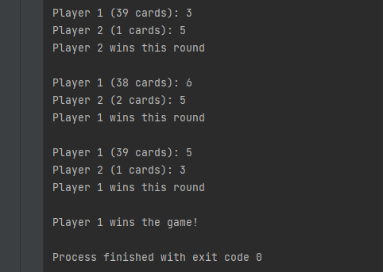

# Card Game implemented using Python 

## A project written in Python showing the card game with instructions to compile and run the game 

## Introduction to game and rules
A card game for built for 2 players. The rules of game are described below:
1.  Create a shuffled deck of cards using "Fisher-Yates Shuffle algorithm".
2.  There are 3 decks of cards for each player i.e draw deck, discard deck, tied deck
3.  Initially discard deck and tied deck have no cards and only draw deck has 20 cards for each player
4.  Distribute the first 20 cards to player1 draw deck and next 20 to player2 draw deck.
5.  In each turn both players draw the top card and compare the values.
6.  The player with higher value wins the round and takes both the cards and add that into its own discard pile.
7.  If there are no cards in the draw pile then shuffle the discard pile and use that as a new draw pile.
8.  Once the player do not have any cards left in draw and discard pile that player loses the game.
9.  When comparing the two same value cards, the winner of next round gets to keep the card.
10. If the same cards are drawn for at least 3 times in a row then these tied cards are added into the next winners discard deck.
11. While comparing teh same value cards in a row for 4 times then the game ends in draw.

## Prerequisite
Python v3.9.17 and higher

## How to install this example Python project on your system
1. Install Python
2. Run the project using the following command:
    `python .\development_challenge.py`

## How to run tests for this example Python project on your system
1. Ensure to have testing library installed:
    `pip install pytest`
2. Run the tests using the following command:
    `pytest .\tests\test_development_challenge.py`

## Screenshots of the output scenarios
1. The game starts and displays 20 cards for each player. The card count decreases as the player draw the card. As player 2 takes out bigger card so player 2 wins the game.

2. When both players draw the same card (as from below screenshot value 6) then no winner in this round. The winner for the next round which is player 2 here should get the 2 tied cards with additional 2 cards for winning next round.

3. When both players draw the same card twice then there is no winner but in next round player 2 wins the round and gets all the 6 cards.

4. End the game whoever has more cards wins and other player is out of the cards loses the game.

5. Game draw, Stalemate situation when 4 times in a row the same cards has been drawn by both players

"# Card-game" 
"# Card-game" 
